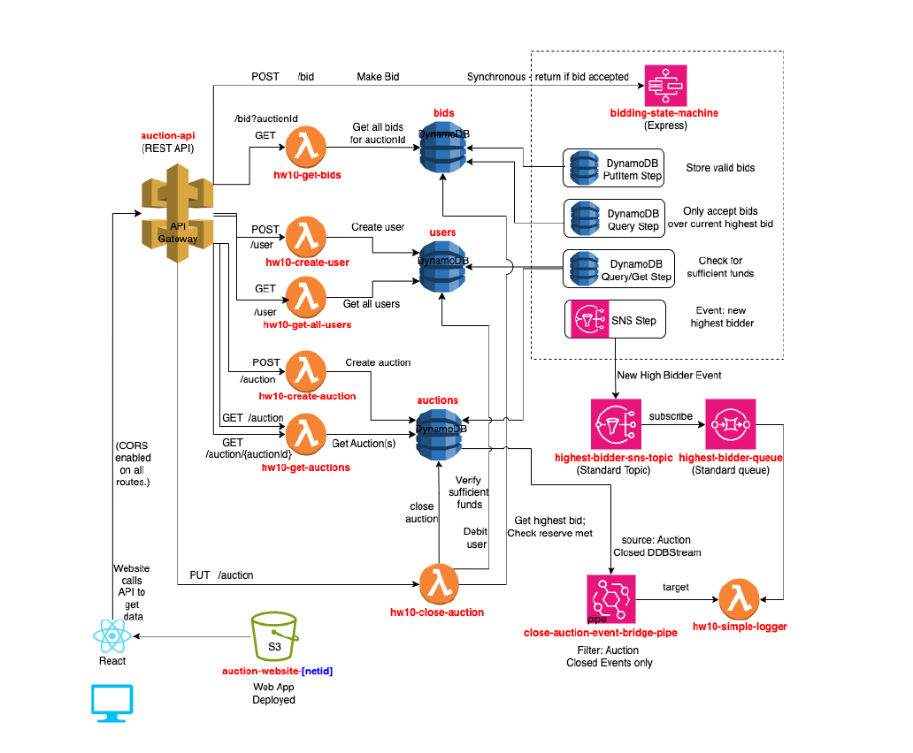

# AWS Serverless Auction Platform

A serverless auction backend built on AWS for managing users, auctions, bids, workflow orchestration, and event-driven processing.

The project was originally deployed in an AWS Learner Lab environment and connected to a course-provided React frontend. My work focused on implementing the backend application logic, API integration, data persistence, bid-processing workflow, event pipeline, and Lambda deployment automation.

> **Project Status**
>
> The original AWS Learner Lab environment is no longer active. This repository is a portfolio version of the project and preserves the backend code, API mappings, deployment workflow, and supporting configuration used during development.
>
> The AWS resources were originally created manually through the AWS Management Console as required by the assignment, so this repository is not intended to recreate the entire environment with a single deployment command.

---

## Overview

The application supported a complete online auction workflow:

- create and retrieve users
- create and retrieve auctions
- view individual auction details
- submit bids
- validate bids against user, auction, and current-bid state
- store accepted bids
- close eligible auctions
- assign a winning bidder
- update the winner's account balance
- process events asynchronously through AWS messaging services

The backend was built using a serverless and event-driven AWS architecture centered around:

- Amazon API Gateway
- AWS Lambda
- Amazon DynamoDB
- AWS Step Functions
- Amazon SNS
- Amazon SQS
- Amazon S3
- GitHub Actions

---

## System Design

The system was implemented according to the following design provided for the project:



*Design diagram provided by the CSE 3250 course staff and used as the implementation specification for the project.*

The architecture separates synchronous API operations, bid-processing workflow logic, persistent storage, and asynchronous event processing.

---

## How the Application Worked

### 1. React Client

A complete React frontend was provided as part of the course assignment.

The frontend was intentionally left unchanged except for a `.env` value containing the production API Gateway base URL.

The client contained screens for:

- users
- auctions
- auction bidding

When the original system was deployed, the compiled React application was hosted as a static website in Amazon S3.

My implementation focused on the AWS services and backend APIs consumed by this frontend.

---

## 2. API Gateway

Amazon API Gateway acted as the entry point between the React application and the AWS backend.

The application exposed operations for:

- creating users
- retrieving users
- creating auctions
- retrieving auctions
- retrieving individual auction details
- retrieving bids for an auction
- submitting new bids
- closing auctions

Depending on the operation, API Gateway routed the request either to an AWS Lambda function or to the bid-processing Step Functions workflow.

The project used the same API integration style consistently across the API and handled response transformation and CORS behavior as required by the application.

---

## 3. Users

User information was stored in a DynamoDB `users` table.

Each user contained data including:

- `userId`
- name
- account balance

The backend included Lambda functions for creating users and retrieving the available users.

### Create User

A create-user request followed this flow:

```text
React Client
    |
    v
API Gateway
    |
    v
create_user Lambda
    |
    v
DynamoDB users table

```
## AWS Service Responsibilities

Each AWS service had a specific responsibility in the auction platform.

### Amazon API Gateway

API Gateway served as the main entry point for requests from the React frontend.

It exposed routes for operations such as:

- creating users
- retrieving users
- creating auctions
- retrieving auctions
- retrieving individual auction details
- retrieving bids
- submitting bids
- closing auctions

Depending on the route, API Gateway forwarded the request either to a Lambda function or to the Step Functions bidding workflow.

---

### AWS Lambda

Lambda functions implemented the backend application logic.

The project used separate Python Lambda functions for different operations, including:

- creating users
- retrieving users
- creating auctions
- retrieving auctions
- retrieving individual auctions
- retrieving bids
- closing auctions
- processing asynchronous queue events

Using separate Lambda functions kept the backend modular and aligned each function with a specific API or event-processing responsibility.

---

### Amazon DynamoDB

DynamoDB stored the application's persistent data.

The project used three tables:

- `users`
- `auctions`
- `bids`

The `users` table stored user account information and balances.

The `auctions` table stored auction information such as the reserve price, auction status, and winning user.

The `bids` table stored bid records associated with individual auctions.

DynamoDB was accessed by Lambda functions and the Step Functions workflow throughout the application.

---

### AWS Step Functions

Step Functions handled the bid-processing workflow.

Instead of placing all bid-validation logic inside one Lambda function, the state machine coordinated the sequence of checks required before accepting a bid.

The workflow verified that:

- the user existed
- the user had enough available funds
- the auction existed
- the auction was open
- the new bid was greater than the current highest bid

If the bid passed all validation checks, it was stored in DynamoDB.

The state machine used JSONata for conditions and data transformation, as required by the original project specification.

---

### Amazon SNS

Amazon SNS was used to publish events produced by the bidding workflow.

When a new valid highest bid was accepted, an event could be published to the SNS topic.

SNS allowed the application to separate the bid-processing workflow from downstream consumers.

This meant the bidding request did not need to directly execute every follow-up action itself.

---

### Amazon SQS

Amazon SQS acted as the message queue for asynchronous event processing.

Messages published through SNS were delivered to the SQS queue.

The queue provided a buffer between the event producer and the Lambda consumer, allowing events to be processed independently of the original bid request.

This helped create a decoupled event-driven architecture.

---

### Logger Lambda

A dedicated Lambda function consumed messages from the SQS queue.

In this project, the function acted as a simple event logger for the asynchronous messaging pipeline.

The flow was:

```text
Accepted Bid
    |
    v
Amazon SNS
    |
    v
Amazon SQS
    |
    v
Logger Lambda

